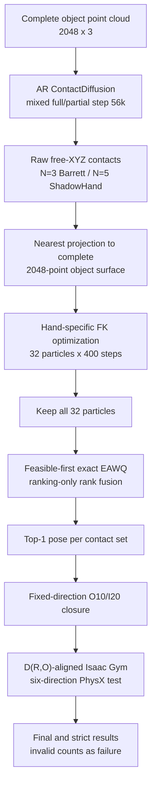

# Basic Experiment v6 Workflow

This is the collaborator-facing entry point for the current frozen basic
experiment. Unless an experiment is explicitly marked as an ablation or a
historical replay, "basic experiment" means v6.

The authoritative machine-readable definition is
[`basic_experiment_mixed_full_partial_ar56k_eawq_o10i20_palm0_v6_protocol.yaml`](../configs/basic_experiment_mixed_full_partial_ar56k_eawq_o10i20_palm0_v6_protocol.yaml).
Do not reconstruct the protocol from this prose when the YAML can be read
directly.

## 1. Pipeline at a glance



The formal OOD-10 budget is:

```text
10 objects x 2 hands x 32 contact sets
  x 32 FK particles x 400 optimization steps
=> 20,480 analytic FK candidates
=> 640 EAWQ Top-1 PhysX trials
```

## 2. Frozen model and observation

The repository includes the exact v6 model:

```text
weights/v6/step_00056000.pt
size:   86,709,034 bytes
sha256: 05bd542bb0c10a74ed8dafd7586a58ceedb17097dd08eb344011bb91e98516b4
```

The checkpoint was trained with `mixed_full_synthetic_partial`: 50% complete
point clouds and 50% synthetic view-facing partial point clouds. Both branches
use the complete object geometry for center/max-radius normalization.

v6 inference deliberately uses the complete `2048 x 3` point cloud. It does
not sample a viewing direction, crop 50% of the points, or resample a synthetic
partial cloud. The AR model generates continuous free-XYZ contacts. These raw
contacts are preserved in the candidate JSON and separately projected to the
nearest point on the complete 2048-point surface for FK optimization.

The formal runner prefers the repository checkpoint. It falls back to the
original compute-platform absolute path only when the bundled file is absent.

## 3. FK pose generation

Both hands use D(R,O)-aligned kinematic assets during FK optimization and the
same corresponding hand models during PhysX validation:

| Item | Barrett | ShadowHand |
|---|---|---|
| Contacts per set | 3 | 5 |
| FK particles per set | 32 | 32 |
| FK steps | 400 | 400 |
| Learning rate | 0.005 | 0.005 |
| Palm-distance gradient weight | 0 | 0 |
| Palm target/gate | 1 mm / 12 mm | 1 mm / 12 mm |

The main energy is:

```text
100 E_contact
+ 100 E_point-cloud-penetration
+ 100 E_self-collision
+ 2 E_approach
+ 0.001 E_joint
+ 0 E_palm-distance
```

Palm distance is still computed and remains part of the 12 mm feasibility
gate; only its optimization gradient weight is zero. FC/DFC energies are not
enabled.

The deterministic generation seed is:

```text
20260808
+ 1000003 * global_hand_index
+ 1009 * global_object_index
+ sample_index
```

## 4. EAWQ Top-1 selection

All 32 FK particles from each contact set enter the selector. v6 uses the
frozen `fusion_old_full_residual` rule:

1. Apply feasible-first grouping. If a set has no feasible particle, retain
   the fallback status and rank all particles analytically.
2. Compute the distal-plus-palm weighted mean residual.
3. Compute the full-hand weighted mean residual.
4. Convert both residuals to within-set average ranks mapped to `[0, 1]`.
5. Average the two ranks equally; lower is better.
6. Use original candidate rank only as the final deterministic tie-break.
7. Send exactly one candidate per contact set to PhysX.

Use the exact `--ranking-only` implementation. It skips diagnostics that are
not consumed by the frozen ranking equation, but retains both 80-iteration QP
residuals and produces the same Top-K as the full diagnostic implementation.
PhysX success labels must never be read by this selector.

## 5. PhysX execution and success rule

Barrett and ShadowHand both use fixed joint directions and O10/I20 closure:

- outer target: move 10% from the generated contact pose toward the open side;
- inner target: move 20% from the generated contact pose toward the closed side.

After closure, PhysX applies `+X,+Y,+Z,-X,-Y,-Z` acceleration continuously,
one second per direction. State is not reset when the direction changes. The
primary displacement is measured from the object pose at the end of closure,
so motion caused during closure is intentionally excluded from this final
stability measurement.

Frozen simulation values include 100 steps/s, 2 substeps, acceleration
`0.5 m/s^2`, robot/object friction 3, object density `500 kg/m^3`, no gravity,
no ground, and a 2 cm final-displacement threshold. See the protocol YAML for
the full solver and damping definition.

Formal benchmark results use GPU PhysX. Local CPU PhysX is an integration
smoke only and must not be mixed into the formal result table. Invalid trials
count as failures.

## 6. Running the workflow

### Protocol and checkpoint audit

```bash
python scripts/audit_basic_experiment_v6_protocol.py \
  --output /tmp/contactdiff_v6_protocol_audit.json
```

This checks the protocol ID, model/config hashes, model metadata, v5-inherited
sections, full-cloud inference definition, and the bundled checkpoint.

### Local one-set integration smoke

The local smoke runs one `contactdb_apple` contact set for each hand while
keeping the real model, 32 FK particles, 400 FK steps, exact EAWQ, O10/I20 and
six-direction dynamics:

```bash
bash scripts/run_basic_experiment_v6_local_smoke.sh
```

It requires the local D(R,O)/GenDex hand and object assets plus the local Isaac
Gym compatibility environment referenced by the script. Override paths without
editing the frozen protocol when needed:

```bash
CONTACT_V6_PYTHON=/path/to/python \
CONTACT_V6_ISAAC_RUNNER=/path/to/isaacgym/run_python_cpu.sh \
CONTACT_V6_SMOKE_ROOT=/path/to/output \
bash scripts/run_basic_experiment_v6_local_smoke.sh
```

The smoke protocol is
[`basic_experiment_mixed_full_partial_ar56k_eawq_o10i20_palm0_v6_smoke1_protocol.yaml`](../configs/basic_experiment_mixed_full_partial_ar56k_eawq_o10i20_palm0_v6_smoke1_protocol.yaml).
Its reduced object/contact-set counts must not be reported as a formal v6
benchmark.

### Formal OOD-10 run

On the configured 8-GPU compute platform:

```bash
bash scripts/run_basic_experiment_v6_mixed_full_partial_ar56k_ood10_8gpu.sh
```

Useful environment overrides are:

```bash
CONTACTDIFF_PYTHON=/path/to/contactdiff/python
CONTACTDIFF_ISAAC_RUNNER=/path/to/gpu/isaacgym/runner
CONTACT_AR_BASIC_GPU_IDS=0,1,2,3,4,5,6,7
CONTACT_V6_RUN_ROOT=/path/to/new/output/root
```

Always use a new output root for a new formal run. The generic runner supports
stage restart through `CONTACT_AR_BASIC_STAGE=generate|prepare|rank|gym|report`.
Do not change `CONTACT_AR_BASIC_SAMPLES`, the observation mode, checkpoint hash,
particle count, FK steps, ranking mode, or PhysX parameters while calling the
result v6.

## 7. Output layout and provenance

The formal runner writes:

```text
run_root/
  candidates/{barrett,shadowhand}/OBJECT.json
  prepared_all/{barrett,shadowhand}/OBJECT.json
  eawq/metrics/particle_metrics.csv.gz
  eawq/prepared/{barrett,shadowhand}/OBJECT.json
  eawq/selection/eawq_rank_fusion_top1.csv
  results/{barrett,shadowhand}/OBJECT.json
  logs/
  status/
  summary.json
```

Before reporting results, verify at minimum:

- checkpoint step, SHA256 and model type;
- actual inference observation is `full_object_pc`;
- raw free-XYZ contacts, projected targets and projection distances are stored;
- every contact set contains exactly 32 retained FK particles;
- EAWQ manifest says `ranking_only=true` and `labels_used=false`;
- 32 Top-1 trials exist per object and hand, 640 total for OOD-10;
- actual backend is GPU PhysX for formal results;
- invalid, fallback, final and strict counts are reported separately;
- start/end times and relevant config/asset hashes are retained.

## 8. Collaboration rules

- Treat the protocol YAML as immutable. Create a new protocol ID for any changed
  model, observation, candidate budget, energy, ranking, closure, asset, PhysX
  parameter, seed or success definition.
- Never overwrite a formal run directory or relabel historical v1-v5 results as
  v6.
- Do not report the local one-set smoke as a success-rate measurement.
- Do not combine CPU and GPU PhysX trials in one aggregate.
- Keep analytic selection independent of PhysX success labels.
- Record both the intended protocol and the parameters actually executed.

For the Chinese frozen configuration summary, see
[`BASIC_EXPERIMENT_CONFIG_PROMPT.md`](BASIC_EXPERIMENT_CONFIG_PROMPT.md). For
configuration history and claim boundaries, see
[`BASIC_EXPERIMENT_POST_FREEZE_LEDGER_ZH.md`](../reports/BASIC_EXPERIMENT_POST_FREEZE_LEDGER_ZH.md).
