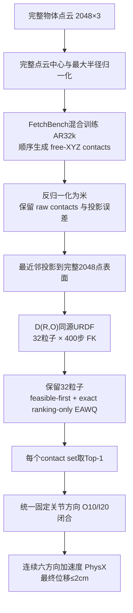

# 基础实验 v7：FetchBench 伪真实观测训练模型

冻结日期：2026-09-12。v7只替换v6的模型权重及其训练来源记录。
推理输入、采样预算、FK、EAWQ、闭合和PhysX沿用v6。

## 1. 使用哪个模型

仓库权重：[weights/v7/best_val.pt](../weights/v7/best_val.pt)。
模型为K=128体系的AR ContactDiffusion，内嵌step=32000，SHA256：

```text
c55badbd2e1ce7bc9cda9b58832e68003b4b757ee02eedee47e01e697c7ec491
```

本阶段从mixed56k的best_val模型warm start，以4×4090、每卡batch192、
有效batch768、学习率5e-5继续训练32k新更新。best_val与同目录显式32k
checkpoint的模型参数已逐项核对相同；v7按上述best_val文件hash冻结。

训练条件按概率混合：

| 观测 | 比例 | 含义 |
|---|---:|---|
| FetchBench伪真实partial | 60% | 仿真深度相机产生的可见表面点云 |
| synthetic partial | 20% | 完整点云按随机方向保留50%后重采样 |
| full | 20% | 完整物体点云 |

训练仍使用原MultiDex K=128接触标签筛选体系。新增的是相机观测条件，
不意味着引入了真机采集或把FetchBench抬升成功标签替代为接触标签。
三类条件均为2048×3、物体坐标系、完整几何中心/最大半径归一化，无观测类型flag。

## 2. 全流程



1. **输入**：完整2048×3点云。v7基础推理不生成随机视角、不做50%裁剪。
   使用真实camera partial作输入应另建实验协议；当前“其他不变”保留full输入。
2. **生成接触**：AR逐点生成，使用已经生成的前缀，每点DDIM50步。
   Barrett每set 3点，ShadowHand每set 5点；每物体每手32个sets。
   模型内部不投影，反归一化后由FK适配器投影到完整2048点表面。
3. **生成姿态**：每set初始化32个粒子，联合优化root姿态与手关节400步，
   学习率0.005。使用与仿真相匹配的D(R,O)同源URDF和既有root/joint映射。
4. **优化能量**：

   ```text
   100 E_contact + 100 E_pc-penetration + 100 E_self
   + 2 E_approach + 0.001 E_q + 0 E_palm-distance
   ```

   两手palm_distance_weight=0；掌心距离仍计算，目标1mm、gate12mm保留，
   FC/DFC不启用；mean/CVaR、碰撞采样等参数沿用v6。
5. **EAWQ**：保留全部32粒子；末端+掌心残差和全手残差分别转换为组内
   0–1平均名次，等权融合，低分优先。feasible-first；全不可行时仍以相同
   排序选fallback，并记录标记。并列以原candidate rank裁决；不读取成功标签。
   exact ranking-only保留两路80步QP，省去不参与排序的诊断量。
6. **闭合**：两手固定关节方向O10/I20；outer向打开侧走剩余范围10%，
   inner向闭合侧走剩余范围20%。root和未参与闭合的关节沿用既有控制。
7. **验证**：闭合100步后记录物体位置，连续施加+X,+Y,+Z,-X,-Y,-Z方向
   的0.5m/s²加速度，每方向1秒，切换方向时位置和速度连续、不归零。
   以闭合结束到六方向全部结束的位移≤0.02m作为final判据，同时报告strict；
   invalid计失败。

固定seed公式：

```text
20260808 + 1000003*global_hand_index + 1009*global_object_index + sample_index
```

## 3. 实验规模与物理参数

OOD-10物体和两种手保持原清单：
ContactDB apple、camera、cylinder_medium、door_knob、rubber_duck、
water_bottle；YCB baseball、pear、potted_meat_can、tomato_soup_can。

- 每物体每手：32×32=1024个解析FK候选，32个EAWQ Top-1。
- 两手10物体：20,480个解析候选，640次正式PhysX trial。
- 正式GPU PhysX：100Hz、2 substeps、摩擦系数两侧均3、物体密度500kg/m³。
- 关节及virtual root stiffness1000、damping200；solver position8/velocity0。
- contact_offset0.01m、rest_offset0、无重力、无地面。
- 本地CPU PhysX只作为集成冒烟，独立标识后端。

完整机器协议：
[v7 protocol](../configs/basic_experiment_fetchbench_ar32k_eawq_o10i20_palm0_v7_protocol.yaml)。
历史[v6流程](BASIC_EXPERIMENT_V6_WORKFLOW.md)用于追溯。

## 4. 运行方式

所有命令从仓库根目录执行；配置所引用的GenDex/D(R,O) URDF、点云、
物体碰撞资产和Isaac Gym环境需要预先配置。仓库权重已附带，资产仍沿用v6布局。

协议及权重审计：

```bash
python scripts/audit_basic_experiment_v7_protocol.py --output /tmp/v7_audit.json
```

本地两手各1-set、32粒子×400步冒烟：

```bash
bash scripts/run_basic_experiment_v7_local_smoke.sh
```

可覆盖CONTACT_V7_PYTHON、CONTACT_V7_ISAAC_RUNNER、CONTACT_V7_SMOKE_ROOT。
冒烟采用单独smoke1协议，不能用于估计正式成功率。

正式OOD-10：

```bash
CONTACTDIFF_PYTHON=/path/to/fk/python \
CONTACTDIFF_ISAAC_RUNNER=/path/to/gpu/isaacgym/runner \
CONTACT_AR_BASIC_GPU_IDS=0,1,2,3,4,5,6,7 \
bash scripts/run_basic_experiment_v7_fetchbench_ar32k_ood10_8gpu.sh
```

CONTACT_V7_CHECKPOINT用于指定同hash的权重副本，CONTACT_V7_RUN_ROOT指定新的
输出目录。分阶段恢复沿用CONTACT_AR_BASIC_STAGE=generate/prepare/rank/gym/report。
恢复时须确保候选、协议与模型hash对应，不复用v6候选冒充v7。

## 5. 产物与结论边界

2026-09-12本地验收：contactdb_apple、两手各1个set，32粒子×400steps、
exact EAWQ Top-1、CPU PhysX；Barrett与ShadowHand的final/strict均1/1，
invalid均0。最终位移分别约0.676mm与0.096mm。这是集成测试，
v7完整640次GPU PhysX尚未执行。
记录见[本地验收报告](../reports/BASIC_EXPERIMENT_V7_LOCAL_ACCEPTANCE_20260912.md)。

输出沿用candidates、prepared_all、eawq/metrics、eawq/prepared、
eawq/selection、results、logs、status、summary.json布局。
需要核对模型hash、训练观测、实际full推理观测、raw/投影接触、配置和URDF
hash、fallback、后端、final/strict/invalid与完整640次分母。

加入相机partial训练的目的是覆盖更接近相机的观测分布；基础full输入下的
抓取收益需要v7完整实验确认。相机训练改善、接触误差下降或历史FetchBench
场景成功率，均不能自动替代v7基础路线的独立PhysX结果。
